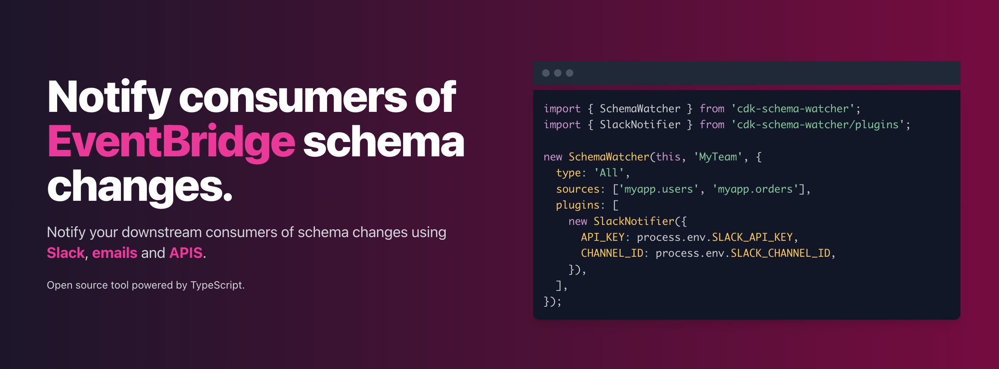
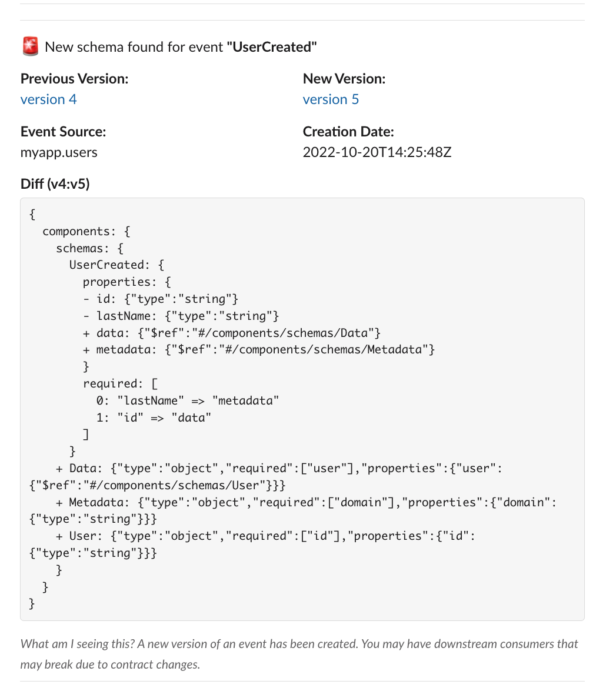
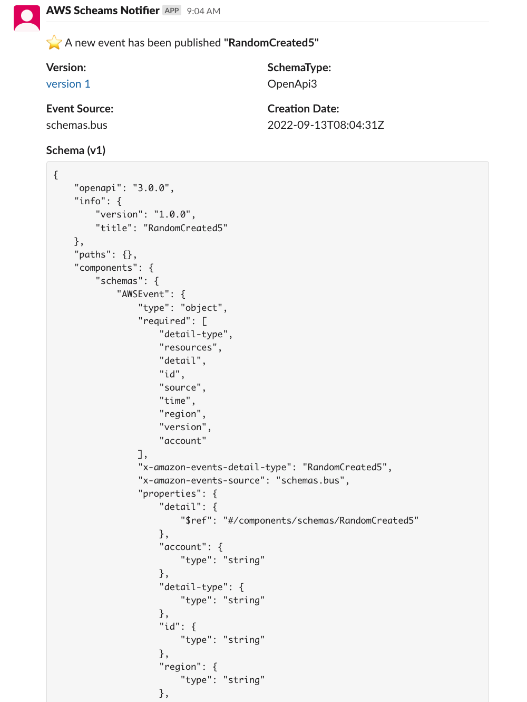

<div align="center">

<h1>📖 EventBridge SchemaWatcher</h1>
<p>EventBridge CDK construct that will notify your downstream consumers of schema changes (with plugin support).</>

[![MIT License][license-badge]][license]
[![PRs Welcome][prs-badge]][prs]
<!-- ALL-CONTRIBUTORS-BADGE:START - Do not remove or modify this section -->
[](#contributors-)
<!-- ALL-CONTRIBUTORS-BADGE:END -->

[![Watch on GitHub][github-watch-badge]][github-watch]
[![Star on GitHub][github-star-badge]][github-star]


<hr />



  <h3>Features: Notify downstream consumers of schema changes with EventBridge, Plugin architecture, Setup in minutes...</h3>

[Read the Docs](https://cdk-schema-watcher.vercel.app/) | [Edit the Docs](https://github.com/boyney123/cdk-schema-watcher) | [View Example](#example-using-schemawatcher-cdk-construct-with-the-slack-plugin)

</div>

<hr/>

# Core Features

- 🔎 Consumers sign up to any changes to events
- 🔔 Get notified anywhere you want
- 📊 Plugin architecture
- ⭐ Setup in minutes

**All powered by CDK**

# Why use SchemaWatcher?

SchemaWatcher is a CDK construct that can help you scale your event-driven architecture by allowing event consumers to subscribe to schema changes.

Amazon EventBridge is a serverless event bus that lets you receive, filter, transform, route, and deliver events, you can write custom event producers and listen to them downstream with custom rules and consumers.

Amazon EventBridge also offers a Schema Registry. EventBridge provides schemas for all events that are generated by AWS services and when you turn on schema discovery it will automatically detect and provide schemas for your custom events (OpenAPI and JSON Schemas).

When producers make changes to events or raise new events onto your EventBridge bus, EventBridge will automatically picks up these changes (with schema discovery turned on), and either make new schemas or update schemas for you.

Consumers can use these schemas to validate events, understand what is in the payload of events or even document their event-driven architecture using tools like EventCatalog.

As time goes on your event-driven architectures will grow, keeping on top of producer and consumer relationships can be hard, we are often told that “producers should not know about consumers”. Technically there is an element of truth to this, but you will often find this leads to some problems…

So, what if we could notify consumers of incoming breaking changes in our schema’s? Notifying consumers could help us manage our event-driven architectures and scale them as our organisations scale.

**SchemaWatcher was designed to help developers manage their event-driven architecture. Notifying consumers of any changes to event structures can help catch issues before you see them in production.**

[Read more on the website](https://cdk-schema-watcher.vercel.app/)

# Getting Started

You should be able to get setup within minutes if you head over to our documentation to get started 👇

➡️ [Get Started](https://cdk-schema-watcher.vercel.app/docs/installation)

Or run this command to install the cdk construct

```
npm i cdk-schema-watcher
```

## Example using SchemaWatcher CDK construct with the Slack Plugin

Configure the construct with the Slack Plugin.

```js
import { SchemaWatcher } from 'cdk-schema-watcher';
import { SlackNotifier } from 'cdk-schema-watcher/plugins';

new SchemaWatcher(this, 'MyTeam', {
  type: 'All',
  sources: ['myapp.users', 'myapp.orders'],
  plugins: [
    new SlackNotifier({
      API_KEY: process.env.SLACK_API_KEY,
      CHANNEL_ID: process.env.SLACK_CHANNEL_ID,
    }),
  ],
});
```

## Example outputs

New version of schema found.


New event found



# Contributing

If you have any questions, features or issues please raise any issue or pull requests you like. We will try my best to get back to you.

[license-badge]: https://img.shields.io/github/license/boyney123/cdk-schema-watcher.svg?color=yellow
[license]: https://github.com/boyney123/cdk-schema-watcher/blob/master/LICENCE
[prs-badge]: https://img.shields.io/badge/PRs-welcome-brightgreen.svg?style=flat-square
[prs]: http://makeapullrequest.com
[github-watch-badge]: https://img.shields.io/github/watchers/boyney123/cdk-schema-watcher.svg?style=social
[github-watch]: https://github.com/boyney123/cdk-schema-watcher/watchers
[github-star-badge]: https://img.shields.io/github/stars/boyney123/cdk-schema-watcher.svg?style=social
[github-star]: https://github.com/boyney123/cdk-schema-watcher/stargazers

# License

MIT.
